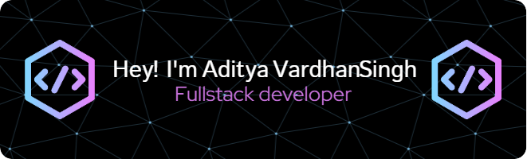

<h1 align="center">Hi 👋, I'm Aditya Vardhan Singh</h1>
<h3 align="center">A passionate & aspirant MERN developer, JavaScript Enthusiast...😜</h3>
  

- 🔭 I’m currently working on **React sites &**

- 🌱 I’m currently learning **MERN Development**

- 🤝 I’m looking for help with **MERN Development**

- 👨‍💻 All of my projects are available at [https://www.crio.do/learn/portfolio/adityavardhansingh642/](https://www.crio.do/learn/portfolio/adityavardhansingh642/)

- 📝 I regularly write articles on [javascriptlegent.blogspot.com](javascriptlegent.blogspot.com)

- 💬 Ask me about **Web Development, MERN Stack**

- 📫 How to reach me **adityavardhansingh642@gmail.com**

- 📄 Know about my experiences [https://drive.google.com/file/d/1BYGwuaow9zMq3DvJBHJuwS2u99VaV7kZ/view?usp=share_link](https://drive.google.com/file/d/1BYGwuaow9zMq3DvJBHJuwS2u99VaV7kZ/view?usp=share_link)

- ⚡ Fun fact **I'm Thinker and also having lots of fun 😄😄**

<h3 align="left">Connect with me:</h3>

<h3 align="left">Languages and Tools:</h3>

               

<h3 align="left">Support:</h3>

  

&nbsp;

